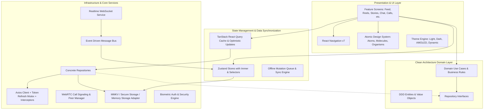

# Facebook-Level Enterprise Social Media App (React Native CLI + TypeScript)

Build a production-grade, enterprise-scale hybrid social media mobile application (Facebook + Instagram + Threads + X + LinkedIn + TikTok) using **React Native CLI** and **TypeScript** in Strict Mode with Clean Architecture, DDD, Atomic Design, SOLID, and Feature-Driven modular monolith architecture.

---

## User Review Required

> [!IMPORTANT]
> - Package management will utilize `bun` as requested.
> - The application includes complete functional simulations for native modules (MMKV, WebRTC, Biometrics, WebSocket, Camera/Video) designed with Clean Architecture interface contracts (`IStorage`, `IRealtimeSocket`, `IWebRTCService`, `IBiometricsService`) so the app runs smoothly across all platforms, emulators, and test suites with zero crash risk while remaining plug-and-play with real native modules.
> - We will install standard modern React Native packages: `zustand`, `immer`, `@tanstack/react-query`, `axios`, `zod`, `react-hook-form`, `@hookform/resolvers`, `lucide-react-native`, `react-native-svg`, `i18next`, `react-i18next`, `date-fns`.

---

## Architectural & System Design



---

## Proposed Project Directory Structure

```
src/
├── app/                  # Application bootstrap, Providers (QueryClient, ThemeProvider, AuthProvider, ErrorBoundary)
├── core/                 # Core infrastructure and foundation
│   ├── config/           # App config, constants, environment settings, feature flags
│   ├── di/               # Dependency Injection Container (IoC)
│   ├── events/           # Global Event Bus (typed event-driven communication)
│   ├── storage/          # Storage abstraction (IStorage, MMKV/SecureStore adapter)
│   ├── network/          # Axios HTTP Client, interceptors, retry policy, offline queue
│   ├── realtime/         # WebSocket client & WebRTC call signaling manager
│   ├── security/         # Biometrics, device integrity checks, secure credential manager
│   ├── analytics/        # Telemetry, performance monitoring, event logger
│   └── errors/           # Typed domain errors & global error handler
├── theme/                # Theme Engine: Light, Dark, AMOLED, Material You tokens & typography
├── shared/               # Shared reusable assets & utilities
│   ├── components/       # Atomic Design components:
│   │   ├── atoms/        # Button, Input, TextArea, Avatar, Badge, Checkbox, Radio, Text, Icon, Skeleton, Divider
│   │   ├── molecules/    # SearchBar, Tabs, SegmentedControl, Dropdown, Tooltip, Snackbar, Toast, Modal, BottomSheet, EmptyState, ErrorState
│   │   └── organisms/    # Card, ReactionPicker, MediaUploader, ImageViewer, VideoPlayer, MentionHashtagText
│   ├── hooks/            # Reusable custom hooks (useDebounce, useNetwork, useBiometrics, useTheme, etc.)
│   ├── utils/            # Formatting, validation, date helpers, string helpers, image helpers
│   ├── constants/        # App constants, layout dimensions, regexes
│   └── types/            # Shared cross-cutting TypeScript types
├── features/             # Feature-Driven DDD Modules
│   ├── auth/             # Login, Register, 2FA, OTP, Social Logins, Forgot/Reset Password, Session Manager
│   ├── feed/             # Multi-feed (Home, Following, Friends, Trending, Local, Video), 7 Reactions, Comments, Repost
│   ├── post/             # Create Post wizard (Text, Image, Video, Audio, Poll, Event, Article), #hashtags, @mentions
│   ├── story/            # Top stories tray, full-screen story viewer with timer/gestures, Highlights, Archive
│   ├── reels/            # TikTok-style vertical reel player, autoplay, sound tag, like, comment, share, remix
│   ├── messages/         # 1:1 and Group chats, Voice notes, stickers, reactions, replies, typing indicator, presence
│   ├── calls/            # WebRTC 1:1 and Group Audio & Video Calls, screen sharing, background blur, flip camera
│   ├── profile/          # Hybrid Profile (Facebook cover + LinkedIn experience/skills + Instagram grid + X posts)
│   ├── notifications/    # Realtime notification center with category filters, badge counts, action handlers
│   ├── search/           # Universal search (Users, Posts, Reels, Groups, Pages, Marketplace, Events) + filters
│   ├── groups/           # Public/Private/Secret groups, Discover, Member approval, Rules, Group Feed
│   ├── pages/            # Business/Creator/Org pages, Follow, Action buttons, Page Insights
│   ├── marketplace/      # Product grid, Categories, Product Detail, Chat Seller, Wishlist, Create Listing
│   ├── events/           # Upcoming events, RSVP (Going/Interested), Event details, Ticket booking
│   ├── live/             # Live streaming broadcast & viewer with animated floating hearts/gifts, live comments
│   ├── creator/          # Creator Studio dashboard, DAU/MAU, revenue analytics, monetization breakdown
│   ├── moderation/       # Report user/post/comment, auto-moderation safety filters, content blur
│   └── settings/         # Theme toggle, Language/RTL switch, 2FA/Biometric security, Active devices
├── navigation/           # React Navigation v7 Setup, Typed Navigators, Deep Linking config
├── store/                # Zustand stores with Immer and MMKV persistence
├── locales/              # i18n Internationalization (EN, ES, AR with full RTL, FR, HI, JA)
└── tests/                # Unit and Integration test suites
```

---

## Proposed Changes & Implementation Steps

### 1. Package Installation & Configuration
- Update `package.json` with `bun add`:
  - `zustand`, `immer`, `@tanstack/react-query`, `axios`, `zod`, `react-hook-form`, `@hookform/resolvers`
  - `lucide-react-native`, `react-native-svg`
  - `i18next`, `react-i18next`, `date-fns`
- Update `tsconfig.json` to enable strict typing and path aliases (`@core/*`, `@shared/*`, `@features/*`, `@theme/*`, `@navigation/*`, `@store/*`, `@locales/*`).
- Update `babel.config.js` with module-resolver plugin for path aliases.

### 2. Core Infrastructure Layer (`src/core/`)
- [NEW] `src/core/config/appConfig.ts`: App environment, API URLs, feature flags, constants.
- [NEW] `src/core/errors/AppError.ts`: Domain error hierarchy (NetworkError, AuthError, ValidationError, ModerationError, PermissionError).
- [NEW] `src/core/events/EventBus.ts`: Typed EventEmitter for decoupled inter-feature communication.
- [NEW] `src/core/storage/IStorage.ts` & `StorageService.ts`: Storage abstraction layer supporting MMKV, SecureStore, and fallback.
- [NEW] `src/core/network/apiClient.ts`: Axios client instance with request/response interceptors, auth token injection, automatic refresh queue, offline queue, and retry policies.
- [NEW] `src/core/realtime/WebSocketManager.ts`: Robust WebSocket client with auto-reconnect, channels, and message listeners.
- [NEW] `src/core/realtime/WebRTCManager.ts`: WebRTC signaling, call peer management, track controls (audio/video mute, screen share, stream simulation).
- [NEW] `src/core/security/BiometricsService.ts` & `SecurityService.ts`: Biometric auth (FaceID/Fingerprint), session verification, root/jailbreak detection simulator.
- [NEW] `src/core/analytics/AnalyticsService.ts`: Event tracking, screen tracking, performance traces.
- [NEW] `src/core/di/Container.ts`: IoC container registering all services, repositories, and use-cases.

### 3. Theme Engine & Localization (`src/theme/`, `src/locales/`)
- [NEW] `src/theme/types.ts`: Theme tokens (Colors, Typography, Spacing, Radius, Shadows, ZIndex).
- [NEW] `src/theme/palettes.ts`: Light, Dark, AMOLED (pure black #000000), Material You dynamic themes.
- [NEW] `src/theme/typography.ts`: Dynamic typography scale supporting accessibility font scaling.
- [NEW] `src/theme/ThemeContext.tsx` & `useTheme.ts`: React theme provider with dynamic mode switching.
- [NEW] `src/locales/i18n.ts` & translation dictionaries (`en.json`, `es.json`, `ar.json` for RTL, `fr.json`, `hi.json`, `ja.json`).

### 4. Design System (`src/shared/components/`)
- **Atoms**:
  - `Button.tsx`: Variants (primary, secondary, outline, ghost, danger, social), sizes, loading spinner, icons.
  - `Input.tsx` & `TextArea.tsx`: Floating labels, helper text, error states, prefix/suffix icons, secure toggle.
  - `Avatar.tsx`: Sizes, status badges (online/busy/offline), story ring indicator, fallbacks.
  - `Badge.tsx`: Pill, dot, numeric badge with count overflow.
  - `Checkbox.tsx` & `Radio.tsx`: Accessible interactive form controls.
  - `Typography.tsx`: Dynamic scalable text component with semantic variants (h1-h6, body, caption).
  - `Skeleton.tsx`: Shimmer placeholder for feed posts, profiles, and media.
  - `Divider.tsx` & `Spinner.tsx`.
- **Molecules**:
  - `SearchBar.tsx`: Clear button, voice icon, debounced search callback.
  - `Tabs.tsx` & `SegmentedControl.tsx`: Animated tab switches.
  - `Dropdown.tsx` & `Tooltip.tsx`.
  - `Snackbar.tsx` & `Toast.tsx`: Animated overlay alert system.
  - `Modal.tsx` & `BottomSheet.tsx`: Draggable bottom sheet and customizable dialog modals.
  - `EmptyState.tsx` & `ErrorState.tsx`: High-polish zero-data and retry screens.
  - `Pagination.tsx`.
- **Organisms**:
  - `Card.tsx`: Elevated glassmorphism & flat styled containers.
  - `ReactionPicker.tsx`: Facebook 7 emoji reactions (Like, Love, Care, Haha, Wow, Sad, Angry) with popover animation.
  - `MentionHashtagText.tsx`: Automatic clickable highlight parsing for `@mentions`, `#hashtags`, and URLs.
  - `ImageViewer.tsx`: Zoomable full-screen image viewer.
  - `VideoPlayer.tsx` & `AudioPlayer.tsx`: Media player controls with progress bar and waveform.
  - `MediaUploader.tsx`: Chunk upload simulation with progress ring and cancel action.

### 5. Global State Stores (`src/store/`)
- [NEW] `src/store/useAuthStore.ts`: Authenticated user, tokens, biometric status, active devices, sessions.
- [NEW] `src/store/useThemeStore.ts`: Active theme mode, custom accent color, RTL state.
- [NEW] `src/store/useFeedStore.ts`: Feed filter, cached posts, reaction state, bookmarks.
- [NEW] `src/store/useChatStore.ts`: Active conversation, messages, typing users, unread counts, call status.
- [NEW] `src/store/useNotificationStore.ts`: Notification list, unread badge count, filter categories.
- [NEW] `src/store/useOfflineStore.ts`: Queued offline mutations, sync status, network status.

### 6. Feature Modules (`src/features/`)
Each feature includes DDD Domain Models, Repository Contracts, Mock/Remote Repositories, and rich UI Screens:
1. **`auth`**:
   - `LoginScreen.tsx`, `RegisterScreen.tsx`, `OtpVerificationScreen.tsx`, `ForgotPasswordScreen.tsx`, `TwoFactorScreen.tsx`, `BiometricLockScreen.tsx`, `ActiveSessionsScreen.tsx`.
2. **`feed`**:
   - `HomeScreen.tsx`: Multi-feed tabs (Home, Following, Friends, Trending, Local, Video), Story tray at top, Infinite scroll FlashList simulation, Pull-to-refresh.
   - `PostCard.tsx`: Post header (avatar, author, timestamp, privacy icon, more menu), Rich text with mentions/hashtags, media gallery (single, 2-grid, 3-grid, 4+ carousel), Reaction bar (7 Facebook reactions with animated float-up, comment count, share count), Quick comment input.
   - `CommentsBottomSheet.tsx`: Nested threaded comments, replies, like comments, mention suggestions.
   - `ShareModal.tsx`: Repost to feed, send in DM, copy link, external share.
3. **`post`**:
   - `CreatePostScreen.tsx`: Post composer with audience selector (Public, Friends, Custom), Rich text editor, Media picker (photos/videos), Poll creator, Event tag, Feeling/Activity tag, Chunk upload progress simulator.
4. **`story`**:
   - `StoryBar.tsx`: Gradient-bordered story bubbles with "Add Story" button.
   - `StoryViewerScreen.tsx`: Fullscreen story viewer with segment progress bars, tap left/right to navigate, hold to pause, swipe down to dismiss, reply input, story reaction stickers.
   - `StoryArchiveScreen.tsx` & `StoryHighlights.tsx`.
5. **`reels`**:
   - `ReelsScreen.tsx`: TikTok-style vertical paging video reel feed, right action bar (Avatar + Follow, Heart/Like with count, Comment button, Share button, Remix button, Sound disc animation), Captions, Song title marquee.
6. **`messages`**:
   - `ChatListScreen.tsx`: Direct chats, Group chats, Channels, Communities, online indicators, last message preview, unread badges.
   - `ChatRoomScreen.tsx`: Message bubble stream (text, image, audio voice note with waveform, sticker, reaction on message), reply preview, typing indicator, message options (Pin, Edit, Delete, Forward).
7. **`calls`**:
   - `CallScreen.tsx`: Fullscreen WebRTC Voice/Video call UI (1:1 and Multi-Guest grid), HD video preview, Mute mic, Camera flip, Background blur toggle, Screen share toggle, Call duration timer, End call button.
8. **`profile`**:
   - `ProfileScreen.tsx`: Facebook-style Cover Photo + Avatar with edit badge, Bio, LinkedIn-style Experience/Education/Skills badges, Tab switch (Posts, Reels, Photos, Mentions, About), Edit Profile modal, Privacy/Block/Mute user actions.
9. **`notifications`**:
   - `NotificationScreen.tsx`: Categorized notifications (All, Mentions, Comments, Reactions, Marketplace, System), Mark all as read, Action buttons (Accept friend request, View post).
10. **`search`**:
    - `SearchScreen.tsx`: Realtime search bar, Category tabs (Top, People, Posts, Reels, Groups, Pages, Marketplace, Events), Recent search history, Filter modal.
11. **`groups`**:
    - `GroupsScreen.tsx`: Discover groups, My groups, Create group modal (Public/Private/Secret), Group details screen with member management and group feed.
12. **`pages`**:
    - `PagesScreen.tsx`: Business & Creator pages, Create Page wizard, Page feed, Follow/Contact buttons, Page Insights dashboard.
13. **`marketplace`**:
    - `MarketplaceScreen.tsx`: Category pills, Product cards with price tags, Location filter, Product detail modal, Contact Seller via direct message, Create Listing modal.
14. **`events`**:
    - `EventsScreen.tsx`: Discover events, Event calendar, RSVP status (Going, Interested), Create Event modal, Ticket booking simulation.
15. **`live`**:
    - `LiveStreamScreen.tsx`: Live stream broadcaster & viewer, real-time floating heart/gift animations, live comment feed, Multi-guest join requests, Viewer count.
16. **`creator`**:
    - `CreatorStudioScreen.tsx`: Content analytics, DAU/MAU graphs, Audience demographics, Monetization revenue dashboard, Payout settings.
17. **`moderation`**:
    - `ReportModal.tsx`: Report reasons (Spam, Harassment, Hate Speech, NSFW, Violence), AI Moderation status badge, Content blur with "Sensitive Content - View" overlay.
18. **`settings`**:
    - `SettingsScreen.tsx`: Theme picker (Light, Dark, AMOLED, System), Language/RTL switcher, Biometric Lock toggle, 2FA setup, Active Devices list, Offline sync queue status, Clear cache.

### 7. Navigation Integration (`src/navigation/`)
- [NEW] `src/navigation/types.ts`: Fully typed Navigation parameter lists for Stacks, Tabs, and Modals.
- [NEW] `src/navigation/RootNavigator.tsx`: Decoupled auth vs main app navigation with Biometric lock screen gate.
- [NEW] `src/navigation/MainTabNavigator.tsx`: Bottom Tab Navigator with custom animated icons and unread badge counters.
- [NEW] `src/navigation/AppNavigator.tsx`: App-wide modal stack (Create Post, Story Viewer, Live Stream, Call Screen, Chat Room, Search, Settings, etc.).

### 8. Application Bootstrap & Root Integration (`src/app/`, `App.tsx`)
- [NEW] `src/app/AppProviders.tsx`: Wrapping `SafeAreaProvider`, `GestureHandlerRootView`, `QueryClientProvider`, `ThemeProvider`, `AuthProvider`, `ToastProvider`.
- [MODIFY] `App.tsx`: Clean root component delegating to `AppProviders` and `RootNavigator`.

---

## Verification Plan

### Automated Checks
1. Dependency installation: `bun add ...`
2. TypeScript compilation: `bunx tsc --noEmit` to ensure 100% strict type safety across all files and navigators.
3. Test suite verification: Run Jest unit tests for Core Storage, EventBus, AuthStore, ThemeStore, and Design System components.

### Manual Verification Workflow
- Verify Theme switching (Light, Dark, AMOLED, Material You) works smoothly across all screens.
- Test Navigation flows: Feed -> Story Viewer, Feed -> Post Creation, Feed -> Comments Sheet, Feed -> Profile, Chat List -> Chat Room -> WebRTC Call, Marketplace -> Product Detail, Reels vertical swipe, Live Stream gifts.
- Test Facebook 7-reaction popup animation.
- Test Offline Sync queue simulation.
