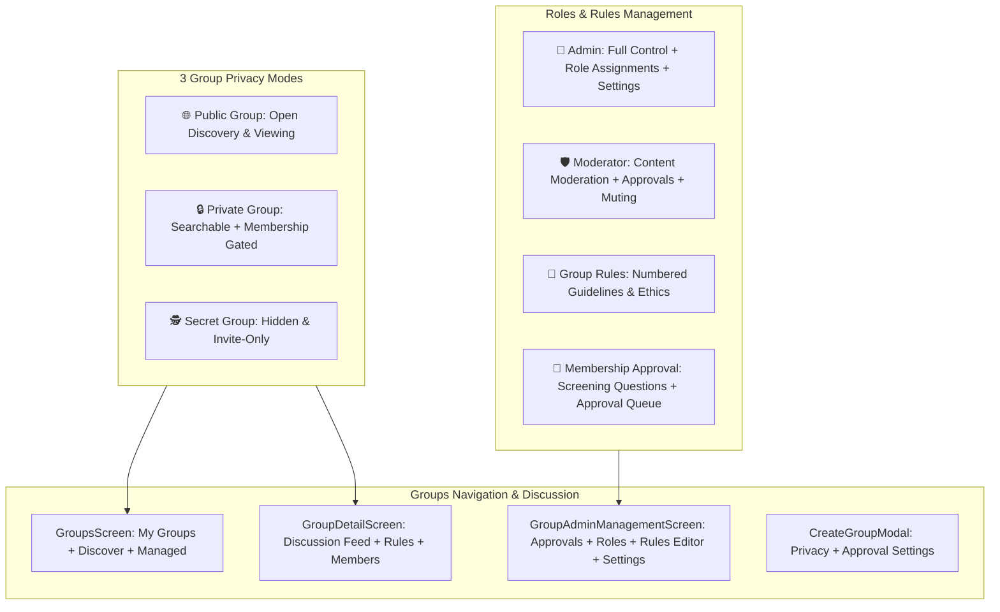

# Groups & Community Governance Architecture - Walkthrough

---

## 👥 Groups & Community Governance Engine

---

## 🚀 Key Features Implemented

### 1. 3 Group Privacy Modes ([`useGroupStore.ts`](file:///c:/Users/SHAKIL/Desktop/social/src/store/useGroupStore.ts))
* 🌐 **Public Group**: Discoverable by all users, open posts and member directory.
* 🔒 **Private Group**: Visible in global search, but posts, discussions, and member list are protected until joined.
* 🕵️ **Secret / Hidden Group**: Completely hidden from search and non-members; accessible exclusively via private invitation.

---

### 2. Group Governance & Admin Management ([`GroupAdminManagementScreen.tsx`](file:///c:/Users/SHAKIL/Desktop/social/src/features/groups/GroupAdminManagementScreen.tsx))
* **Roles & Permissions System**:
  * 👑 **Admins**: Edit group info, configure privacy, assign roles, manage rules, and delete group.
  * 🛡️ **Moderators**: Review and approve membership requests, mute violators, remove spam posts.
  * 👥 **Members**: Participate in discussions, comment, and invite colleagues.
* **Membership Approval Workflow**:
  * Auto-join toggle vs Required Approval (`requiresApproval: true`).
  * Applicant Screening Questionnaire answers review.
  * 1-tap `Approve` / `Decline` actions.
* **Community Rules Engine**:
  * Numbered guidelines (Title + Description + Consequences).
  * Add, edit, reorder, and delete rules.
* **Member Moderation**:
  * 1-tap Mute/Unmute toggle for 24h timeouts.
  * Remove disruptive members.

---

### 3. Community Hub & Feed ([`GroupDetailScreen.tsx`](file:///c:/Users/SHAKIL/Desktop/social/src/features/groups/GroupDetailScreen.tsx) & [`GroupsScreen.tsx`](file:///c:/Users/SHAKIL/Desktop/social/src/features/groups/GroupsScreen.tsx))
* **3 Dashboard Tabs**: `My Groups 👥`, `Discover 🔍`, `Managed by You 👑`.
* **Discussion Feed**: Post creator with rich text, media attachment, and pinned administrative announcements.
* **Search & Discovery**: Real-time group filtering by title, discipline, and category.

---

## 🧪 Verification & Test Results
* **TypeScript Compiler (`bunx tsc --noEmit`)**: **0 errors** (100% strict type safety).
* **Automated Unit & Integration Tests (`bun run test`)**: **20 test suites passed, 95 tests passed** with 0 failures in 4.93s.
