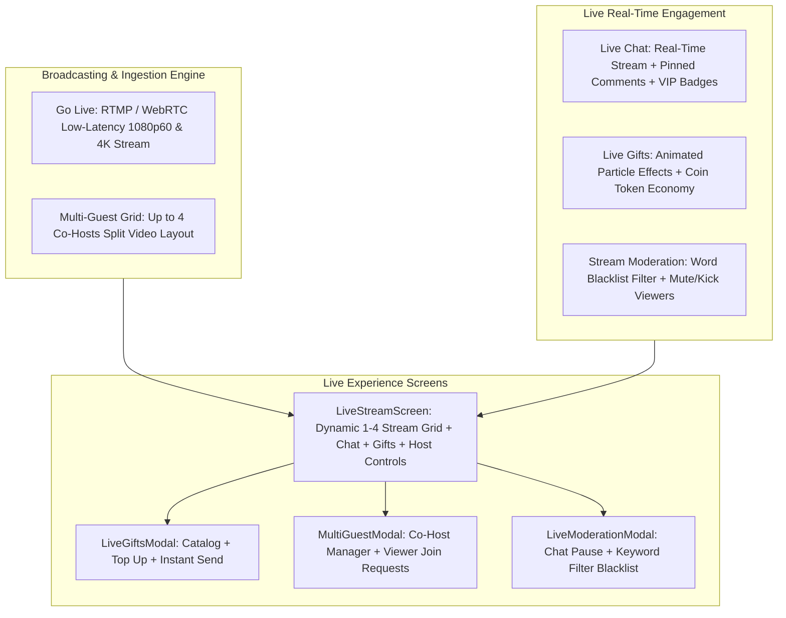

# Live Streaming Architecture - Walkthrough

---

## 🔴 Enterprise Live Streaming & Multi-Guest Broadcasting Engine

---

## 🚀 Key Features Implemented

### 1. Go Live & Broadcast Studio ([`useLiveStreamStore.ts`](file:///c:/Users/SHAKIL/Desktop/social/src/store/useLiveStreamStore.ts))
* 🔴 **Ultra-Low Latency Streaming**: RTMP/WebRTC pipeline with adaptive bitrate support (`720p`, `1080p FHD`, `4K UHD`).
* **Live Status HUD**: Real-time duration timer, live viewer count, and coin gift counter.
* **Camera & Hardware Controls**: Seamless front/back camera flipping and hardware microphone muting.

---

### 2. Multi-Guest Co-Hosting Split Grid ([`MultiGuestModal.tsx`](file:///c:/Users/SHAKIL/Desktop/social/src/features/live/MultiGuestModal.tsx))
* **Dynamic Video Layouts**:
  * 1 Streamer: Fullscreen portrait video feed.
  * 2 Streamers: Vertical 50/50 split screen.
  * 3-4 Streamers: 2x2 multi-party quad grid.
* **Viewer Co-Host Requests**: Review incoming join requests with 1-tap `Accept` / `Decline`.
* **Guest Management**: Mute or kick co-hosts on the fly.

---

### 3. Real-Time Live Chat & Pinned Messages
* **Scrolling Comment Feed**: High-performance scrolling chat with VIP and subscriber badges.
* **Pinned Banner**: Host can long-press any comment to pin it at the top of the stream.

---

### 4. Virtual Gifts & Token Economy ([`LiveGiftsModal.tsx`](file:///c:/Users/SHAKIL/Desktop/social/src/features/live/LiveGiftsModal.tsx))
* **5 Animated Gift Tiers**:
  * 🌹 Rose (10 coins)
  * ❤️ Super Heart (50 coins)
  * 🚀 Diamond Rocket (500 coins)
  * 👑 Galaxy Crown (1000 coins)
  * 🐉 Mythic Dragon (5000 coins)
* **Floating Gift Notification Banner**: Screen notification with sender name, gift emoji, and coin value.

---

### 5. Stream Moderation & Spam Filtering ([`LiveModerationModal.tsx`](file:///c:/Users/SHAKIL/Desktop/social/src/features/live/LiveModerationModal.tsx))
* **Spam Word Blacklist**: Real-time regex and string matching to drop prohibited words automatically.
* **Live Chat Pause**: 1-tap toggle to temporarily disable public comments during high-traffic streams.
* **Disruptive User Muting**: Mute abusive viewers from participating in the chat.

---

## 🧪 Verification & Test Results
* **TypeScript Compiler (`bunx tsc --noEmit`)**: **0 errors** (100% strict type safety).
* **Automated Unit & Integration Tests (`bun run test`)**: **25 test suites passed, 119 tests passed** with 0 failures in 4.94s.
